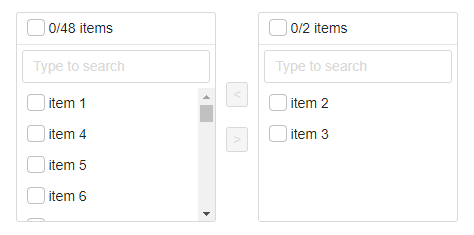

# BlazorTransfer
A JavaScript free Transfer (Dual List) library for [Blazor](https://blazor.net) applications

[](https://www.nuget.org/packages/BlazorTransfer/)



## Getting Setup
You can add them searching *BlazorTransfer* in the Nuget Package Manager or from command line by running *dotnet add package BlazorTransfer*

### Add Imports
Add the following to your *_Imports.razor*

```csharp
@using TransferBlazor
```

## Wiki

- `DataSource` (required) - The source of data.
- `ValueProperty` (required) - The name of the property that contains the value.
- `TextProperty` (required) - The name of the property that contains the display text.
- `@bind-Value` (required) - To bind a list where the `ValueProperty` of the items of the target table will go.
- `ShowSearch` (optional) - Show a field to search. (Default value: *false*)
- `SearchPlaceholder` (optional) - Change the placeholder text in the search field. (Default value: *Type to search*)
- `HeaderText` (optional) - Change the header text. (Default value: *items*)
- `Change` (optional) - Change event of the Transfer. Selected value as event argument.

## Example

```html
@page "/fetchdata"

@inject WeatherForecastService ForecastService

@if (_forecasts == null)
{
    <p><em>Loading...</em></p>
}
else
{
    <BlazorTransfer @bind-Value="_selectedItems" 
                    TItem="int"
                    DataSource="_forecasts" 
                    ValueProperty="TemperatureC" 
                    TextProperty="Summary" 
                    ShowSearch="true"                   
                    Change="(args) => Change(args)" />

    @foreach(var item in _events)
    {
        <span>@item</span>
        <br />
    }
}

@code 
{
    WeatherForecast[] _forecasts;
    List<string> _events = new List<string>();

    IEnumerable<int> _selectedItems = new List<int> { 1, 2, 3 }; //Is int because TemperatureC (ValueProperty) is int too

    protected override async Task OnInitializedAsync()
    {
        _forecasts = await ForecastService.GetForecastAsync(DateTime.Now);
    }

    void Change(IEnumerable<int> args)
    {
        _events.AddRange(args.Select(x => x.ToString()));
    }
}
```
